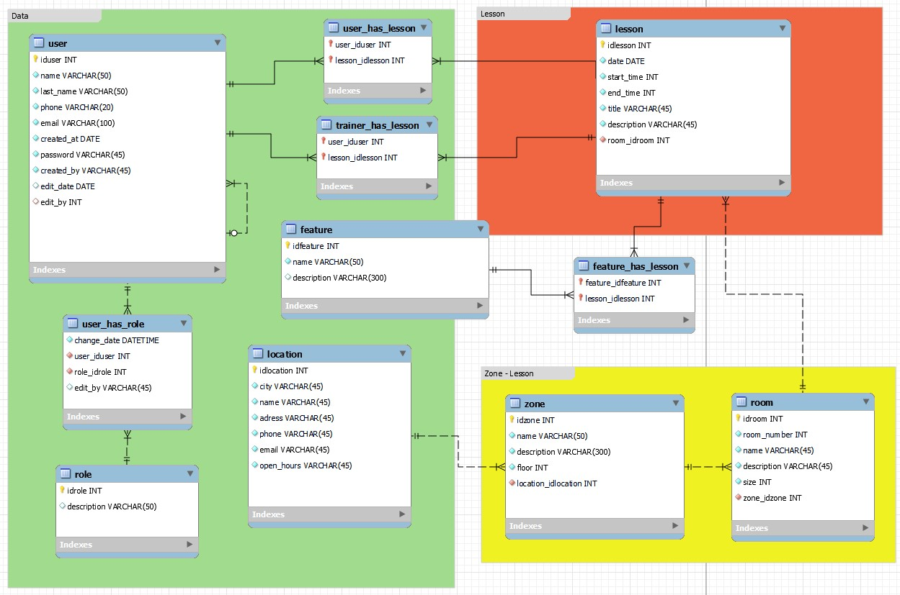
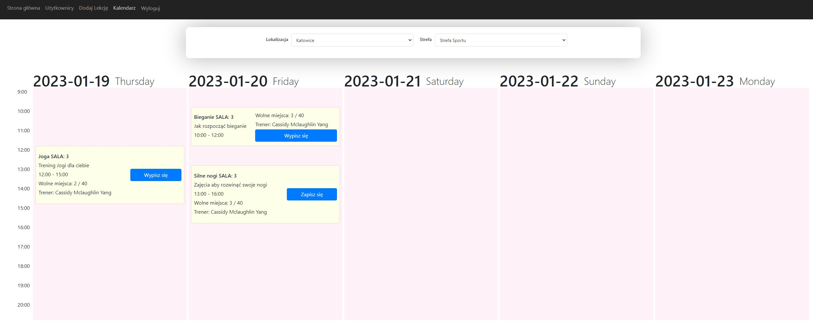
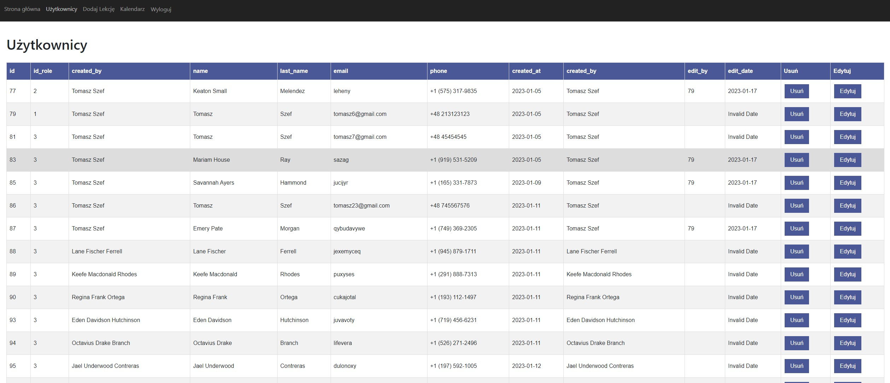

# Fitbea project :)

## Description

Fitbea is a project that aims to help people to keep track of their fitness goals. It is a web application that allows users to create their own fitness routines and share them with other users. It also allows users to follow other users and see their routines.

## Installation

### Requirements

- [Node.js](https://nodejs.org/en/)
- [Yarn](https://yarnpkg.com/en/)
- [mysql](https://www.mysql.com/)
- [Docker](https://www.docker.com/)
- [Docker Compose](https://docs.docker.com/compose/)
- [Git](https://git-scm.com/)
- [Nginx](https://www.nginx.com/)
- [Certbot](https://certbot.eff.org/)

